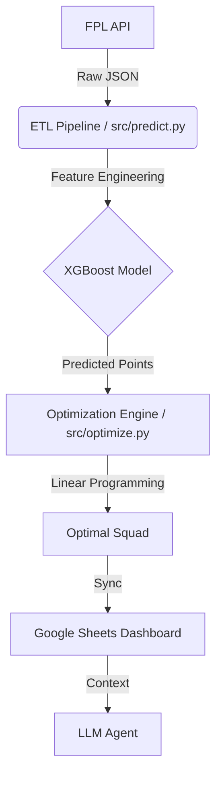

# FPL-AI-Advisor: Algorithmic Sports Trading Engine

## Project Overview

An automated decision support system for Fantasy Premier League (FPL) that frames the game as a resource optimization problem. The system uses a hybrid architecture combining Gradient Boosting (XGBoost) for predictive analytics and Linear Programming (MILP) for constrained portfolio optimization.

It operates as a cyber-physical system, fetching live API data, predicting player performance, and syncing optimal strategies to a cloud dashboard (Google Sheets) for consumption via an LLM agent.

## Architecture



## The "Three-Brain" System

### 1. The Analyst (Predictive Modeling)

**Algorithm:** XGBoost Regressor

**Training Data:** 4+ seasons of historical data (120k+ rows)

**Key Features:**

* Tactical Vulnerability: Quantifies how many points an opponent concedes to specific positions.
* xP Delta: Measures regression to the mean via actual points vs. underlying stats (ICT Index).
* Team Strength Diff: Dynamic ELO-like rating difference between teams.

**Performance:** Mean Absolute Error (MAE) of 1.04 points on the 2024–25 test set.

### 2. The Strategist (Operations Research)

**Library:** PuLP (Python Linear Programming)

**Problem:** Knapsack problem variant with complex constraints.

**Constraints:**

* Budget ≤ £100.0m
* Exact formation rules (2 GK, 5 DEF, 5 MID, 3 FWD)
* Max 3 players per team

**Output:** The mathematically optimal 15-man squad that maximizes expected points.

### 3. The Interface (Cloud Sync)

Automated syncing to Google Sheets. Acts as a knowledge base for an LLM agent, enabling natural language queries such as "Why did the model pick Salah over Haaland?"

## Quick Start

### Clone the Repository

```bash
git clone https://github.com/Splinter0017/fpl-advisor-engine.git
cd fpl-advisor-engine
```

### Install Dependencies

```bash
python -m venv venv
source venv/bin/activate  # or venv\Scripts\activate on Windows
pip install -r requirements.txt
```

### Generate Predictions

```bash
python src/predict.py
```

### Optimize Squad

```bash
python src/optimize.py
```

## Project Structure

* **src/etl.py:** Raw data ingestion pipeline
* **src/model.py:** Training logic for the XGBoost regressor
* **src/predict.py:** Inference script for upcoming gameweeks
* **src/optimize.py:** MILP solver for squad selection
* **data/:** Processed training data and logs
